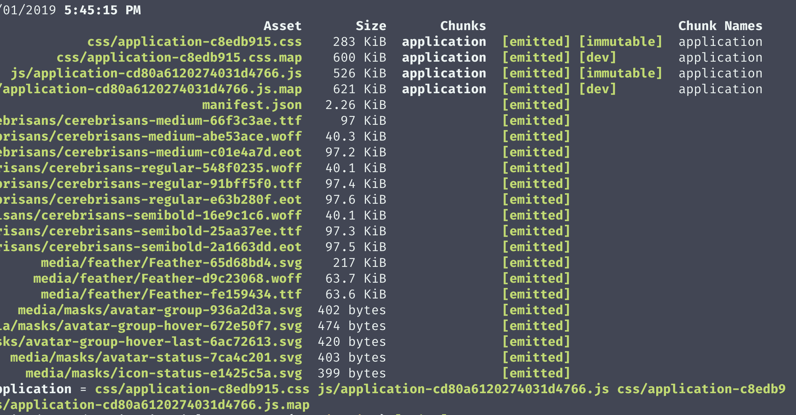
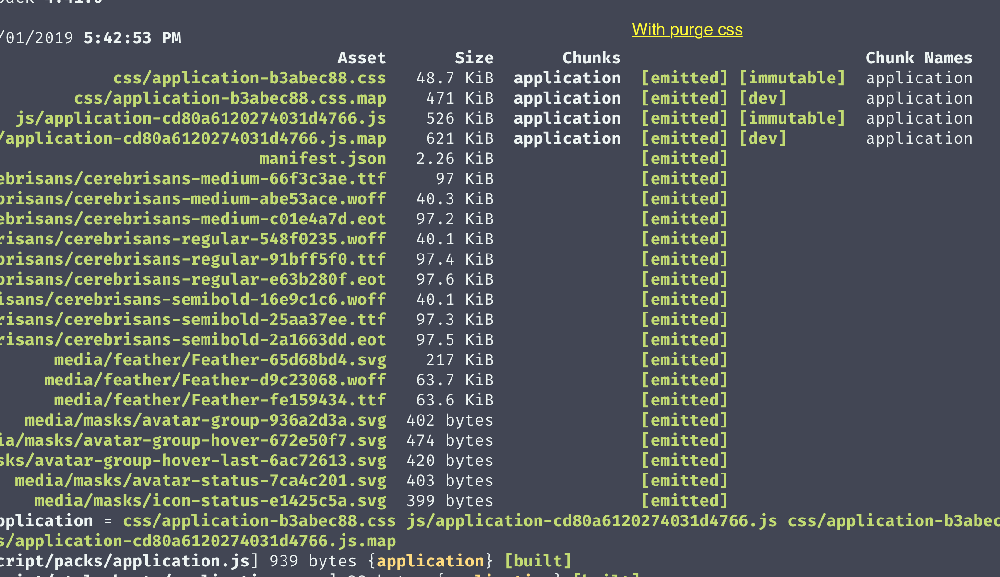

# PurgeCSS  setup in Rails 

 ##  Why
Why using PurgeCSS in my project ?, because we can reduce the size of your assets by a huge amount, making our app loads faster and avoid loading styles that we don't use.

### Bundle size before PurgeCss


### Bundle size After PurgeCss



 ## Setup
 First we need to install the  [@fullhuman/postcss-purgecss](https://github.com/FullHuman/postcss-purgecss) with yarn:
 
 ```
 yarn add -D @fullhuman/postcss-purgecss
 ```
 
 In order to use purge css we need to manage our stylesheets using webpacker instead of the asset pipeline. We can do this following the next steps:
 
 
 1. Change the `stylesheet_link_tag` in the layouts we are using:
 
 Replace `stylesheet_link_tag 'application'` with 
 `stylesheet_pack_tag 'application'`. Also don't forget to include the `<%= javascript_pack_tag 'application' %>` too.

 2. Add the  `application.scss` manifest inside `app/javascript/stylesheets/application.scss` to import all your other css files. Beware to import  your manifest inside `app/javascript/packs/application.js`, example:
 
 ```js
 import "../stylesheets/application.scss"
 ```
 
 ## Purge css configuration
 
 Replace the content of `postcss.config.js` (this file is in the root folder of your project) with this:
 
 ```js
 let environment = {
  plugins: [
    require('autoprefixer'),
    require('postcss-import'),
    require('postcss-flexbugs-fixes'),
    require('postcss-preset-env')({
      autoprefixer: {
        flexbox: 'no-2009'
      },
      stage: 3
    }),
  ]
}

// Only run PurgeCSS in production (you can also add staging here)
if (process.env.RAILS_ENV === "production") {
  environment.plugins.push(
    require('@fullhuman/postcss-purgecss')({
      content: [
        './app/**/*.html.erb',
        './app/helpers/**/*.rb',
        './app/javascript/**/*.js',
      ],
      defaultExtractor: content => content.match(/[A-Za-z0-9-_:/]+/g) || [],
		   // You can whitelist selectors to stop Purgecss from removing them from your CSS. 
      // This can be accomplished with the options whitelist and whitelistPatterns.
      whitelist: []
    })
  )
}

module.exports = environment
 ```

 ## Notes
 - Use the **whitelist** array to add selectors you need to load even if  they don't appear in your view files, one common example for this scenario is making dynamic styles based on the status of a backend variable(links, status badges, etc)
 - Use this only in production or staging 
 - Find more options in the package [documentation](https://github.com/FullHuman/postcss-purgecss)
